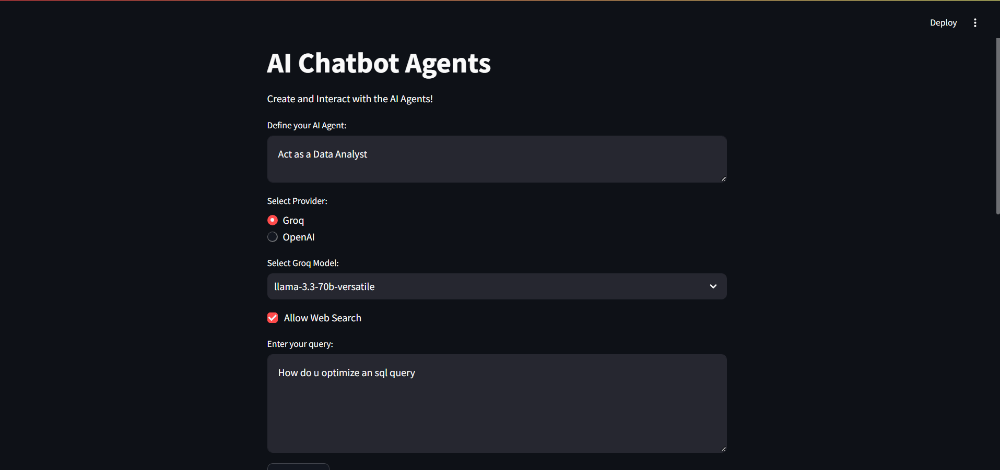
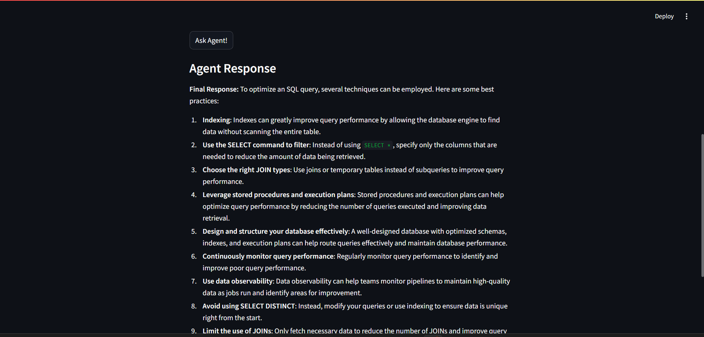
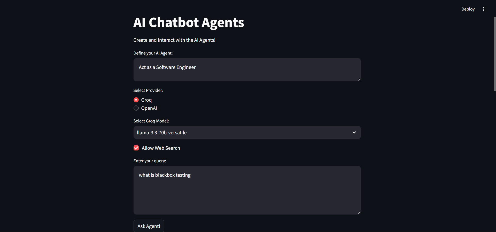
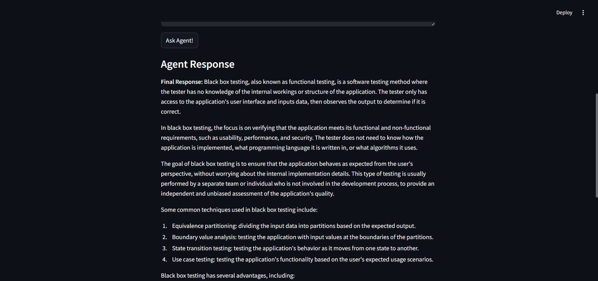
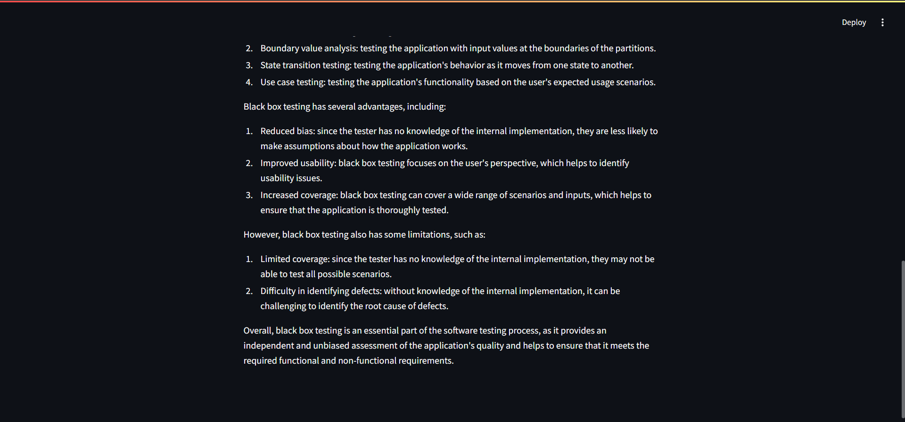

# Project Setup Guide

This guide provides step-by-step instructions to set up your project environment, including setting up a Python virtual environment using pip.

## Table of Contents

1. [Setting Up a Python Virtual Environment](#setting-up-a-python-virtual-environment): [Using pip and venv](#using-pip-and-venv)
2. [Running the application](#project-phases-and-python-commands)
3. [Screenshots](#screenshots)

## Setting Up a Python Virtual Environment

---

### Using `pip` and `venv`

#### Create a Virtual Environment:

```
python -m venv venv
```

#### Activate the Virtual Environment:

**macOS/Linux:**

```
source venv/bin/activate
```

**Windows:**

```
venv\Scripts\Activate.ps1
```

#### Install Dependencies:

```
pip install -r requirements.txt
```

---

#### Install Dependencies:

```
pip install -r requirements.txt
```

# Project Phases and Python Commands

## Phase 1: Create AI Agent

```
python ai_agent.py
```

## Phase 2: Setup Backend with FastAPI

```
python backend.py
```

## Phase 3: Setup Frontend with Streamlit

```
streamlit run frontend.py
```
## Screenshots






## IMPORTANT

### Make sure backend python script is running in a separate terminal
